# Ecommerce Application

In the present work, I have demonstrated my capabilities on the devops theme. I added proper authentication and authorization controls so users can only access their data, and that data can only be accessed in a secure way. 

## Authentication and Authorization
The authentication and authorization is done using a combination of usernames and passwords for authentication, as well as JSON Web Tokens (JWT) to handle the authorization.

## Testing
The unit tests I have implemented at least had 95 percent coverage for classes, 90 percent for methods, 88 percent for lines.

## Splunk

Some Splunk screen-shots:
### Queries
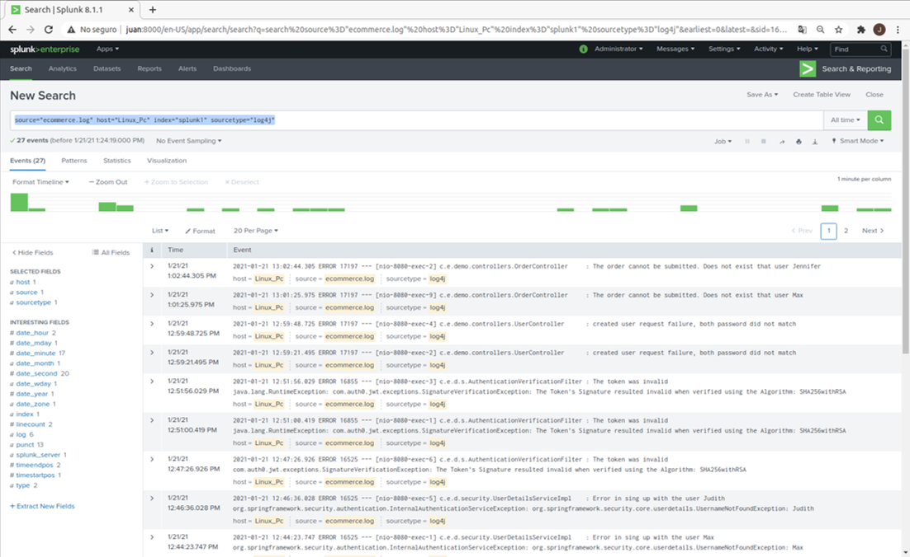
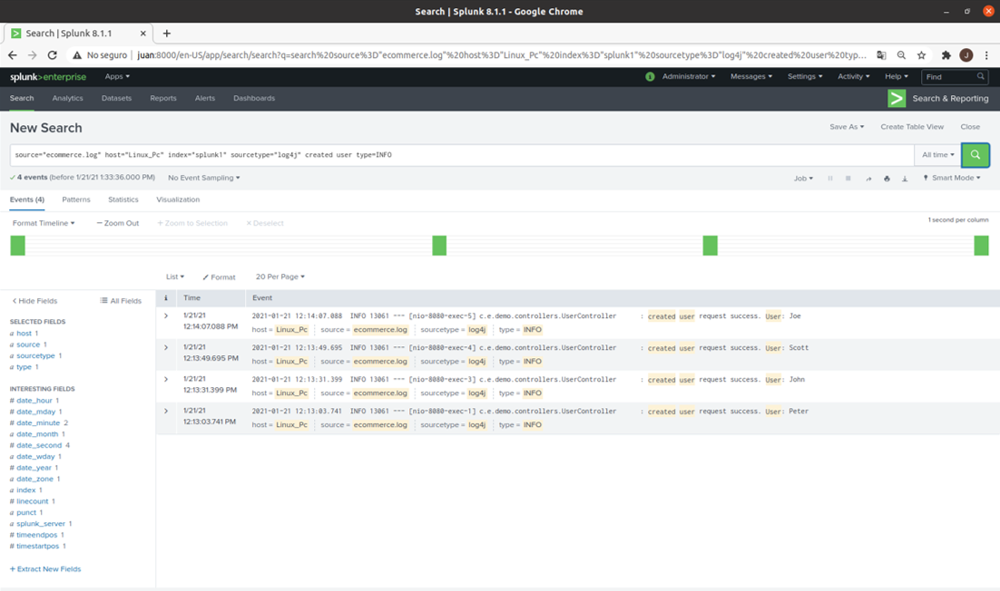
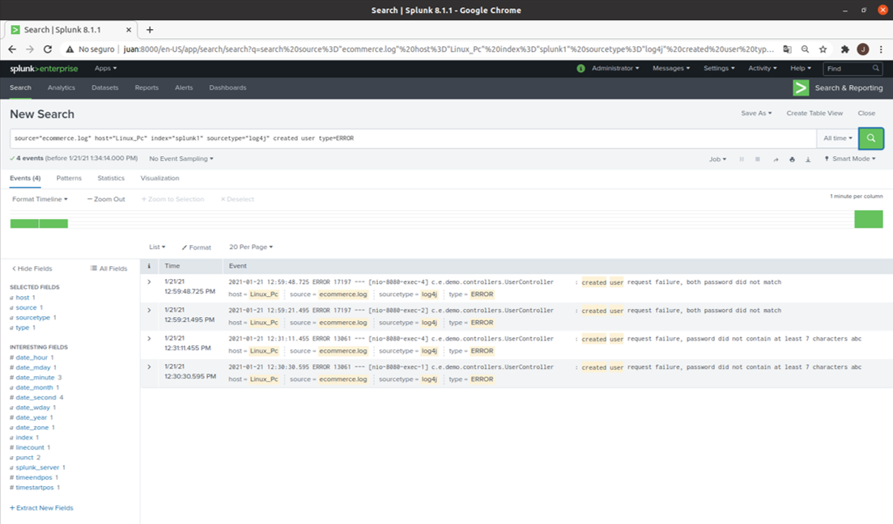
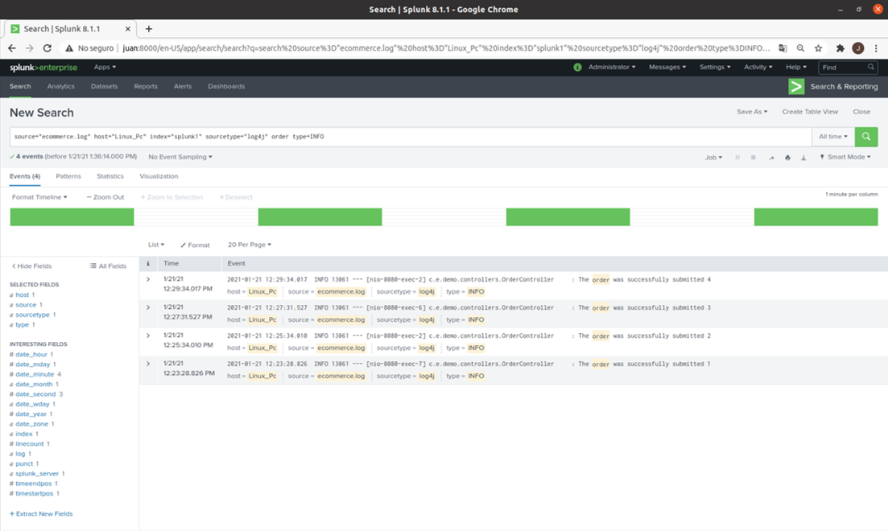
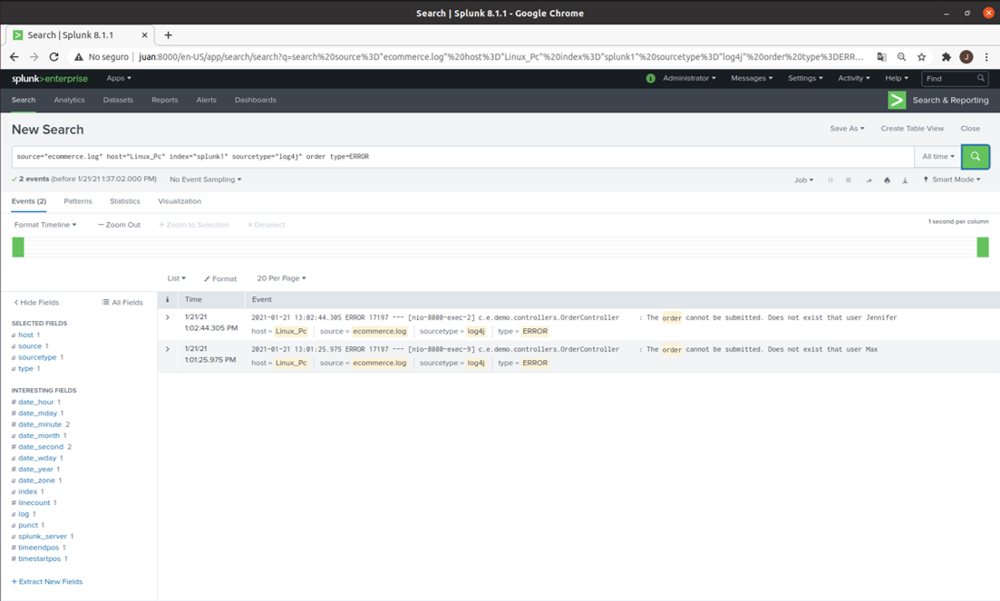
### Alert
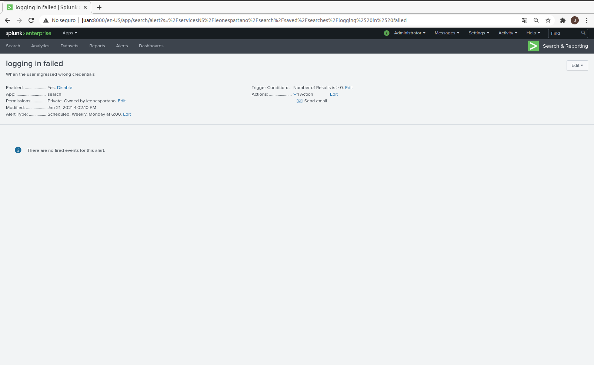
### Dashboard Created User
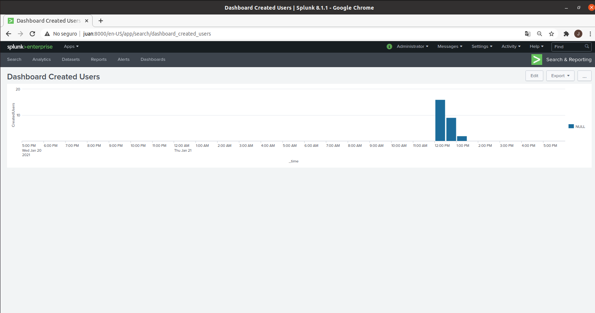

## Jenkins

Some Jenkins screen-shots:

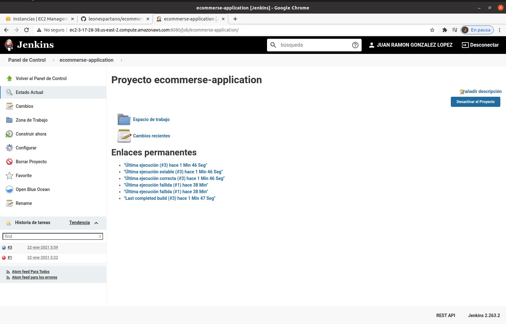

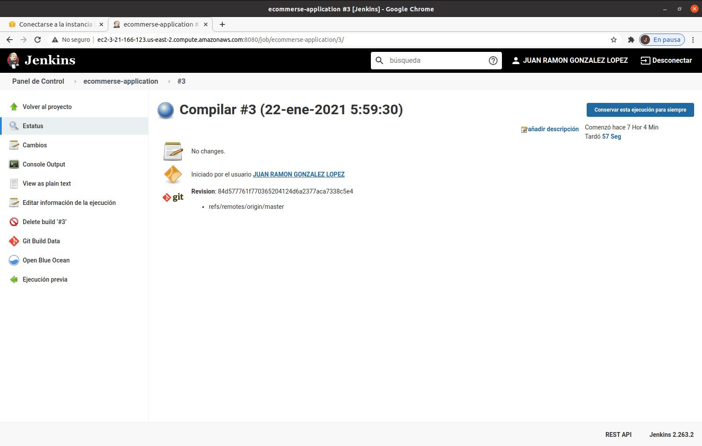
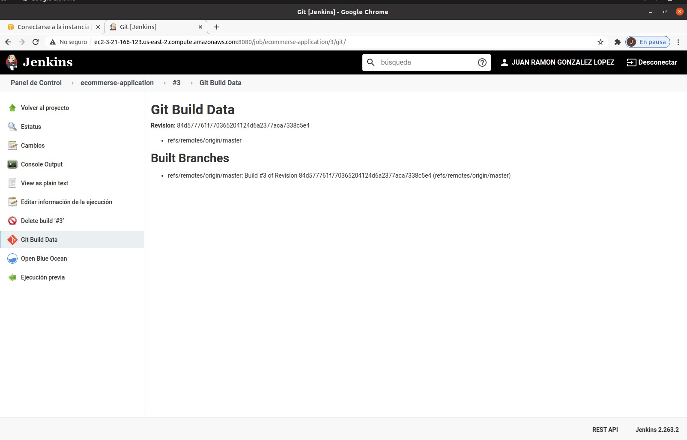
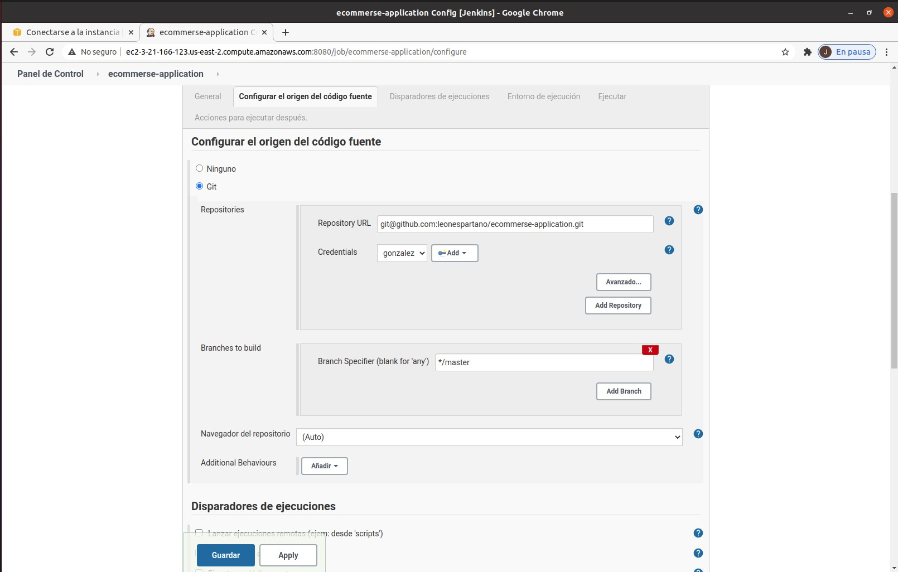

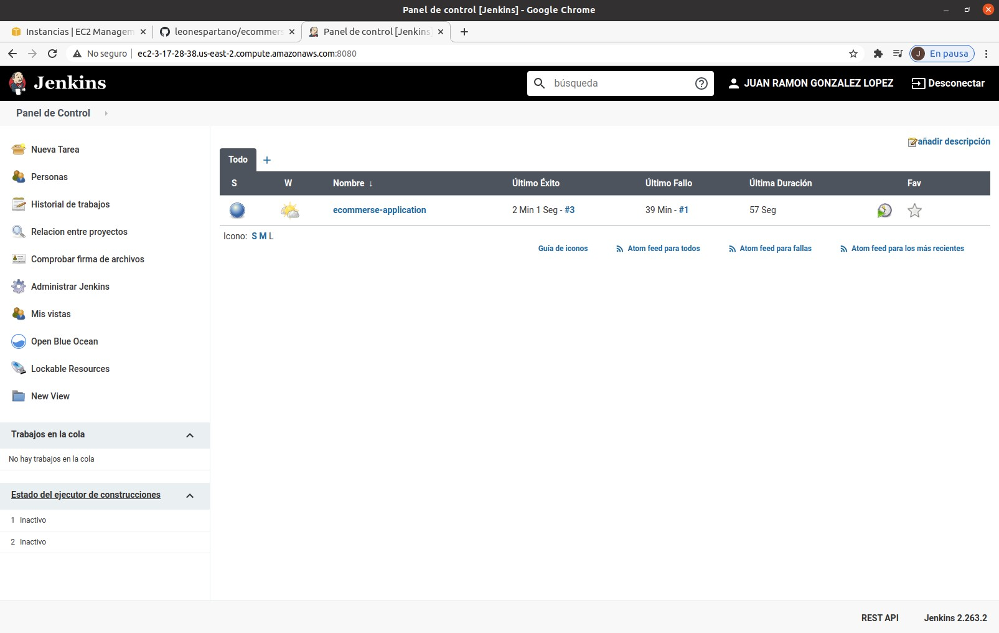
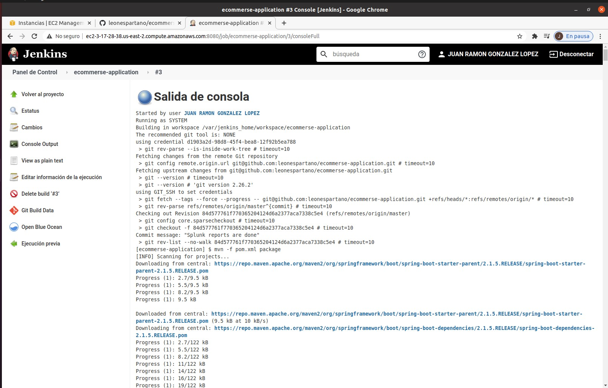
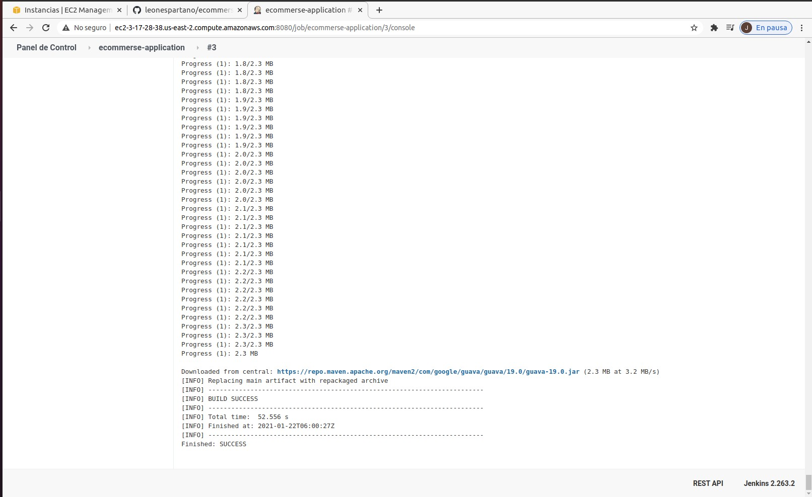
